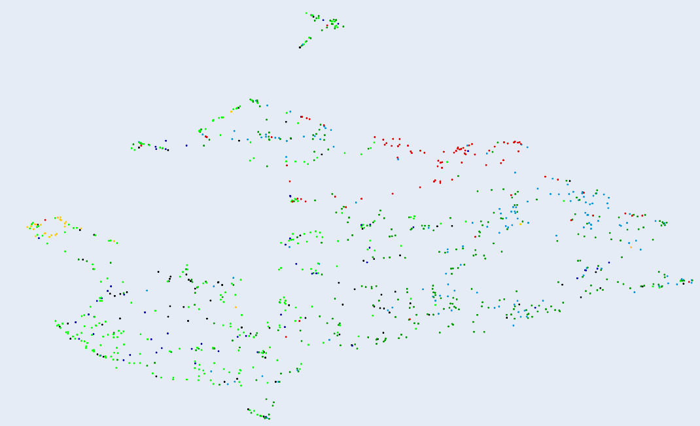

# Earworm

> Search for royalty-free music by sonic similarity

Earworm is a search engine for music licensed for royalty-free commercial use, where you search by sonic similarity to something you already know. Either upload some mp3s or connect your Spotify account, then use clips from songs you like to search for similar songs that are licensed for you to use in your next great video game or YouTube video (always verify the license terms first; many licenses still require attribution!). You can search for the overall closest fit, or choose to focus matching genre, mood, or instrumentation. All the audio processing is done in your browser; your music never leaves your device.


> A 2d projection of some embeddings, in this case colored by mood

## Status

This is a *Work in Progress*! Some features are actively being developed, and I'm currently evaluating multiple models, so search results may change (hopefully improve!) over time. Check the current live version at [https://earworm.dev](https://earworm.dev).

## Installation

The modeling and webapp enviornments are independent. To set up the modeling environment, you'll need Conda.

### Modeling

```sh
git clone https://github.com/reppertj/earworm.git
cd earworm/modeling
conda env create -f environment.tml
```

### Webapp

To run the webapp locally in development mode, you'll need Docker and Docker Compose.

```sh
git clone https://github.com/reppertj/earworm.git
cd earworm
```

In the `earworm` directory, create a `.env` file modeled after `.env.example`. To start the backend, run:

```sh
docker-compose up
```

This will take several minutes the first time, as the images need to be built. After everything is running, you can visit
`localhost/docs` to see the backend Swagger UI. In development mode, both the backend and the worker containers will live reload after changes to `*.py` files in the `backend` directory.

The frontend container only serves the compiled version of the app via nginx. To work on the frontend in development with live reloading, devtools, etc:

```sh
cd frontend
npm install
npm start
```

You can now visit the frontend at `localhost:3000`. The frontend proxies requests to the backend mapped via docker to `localhost:80/api`, so you can take advantage of local live reloading while working on the full stack at once.

In development mode, both the frontend and celeryworker containers install an instance of Jupyter lab, so you can drop in to the container to interactively investigate how things are working. To start the notebook server on the worker, for instance:

```sh
docker-compose exec celeryworker bash
$JUPYTER
```

This will print a link with an access token that you can visit on your local machine (outside the container).

## Manual Deployment

Here is one way to manually deploy the site, using a combination of an S3-compatible object storage service and VPS instances running Ubuntu with attached block storage to persist (a) the database and (b) https certificates. This can also serve as the basis for automated deployments. You can deploy the project on a "cluster" of a single node or across multiple nodes.

### Part 1: Build the containers

1. Ensure that Docker on your build machine is logged into a private container registry, and the following environment variables point to where these containers should be pushed to the registry (without the tag suffixes):

    ```bash
    DOCKER_IMAGE_BACKEND
    DOCKER_IMAGE_CELERYWORKER
    DOCKER_IMAGE_FRONTEND
    ```

2. Set the `TAG` environment variable as appropriate, e.g., `dev`, `stag`, `latest`

3. Run `scripts/build-push.sh`

### Part 2: Configure your DNS and cloud services

1. You'll need at least one server running Docker and Docker Compose. These instructions were tested on Docker 19.03.13 and Docker-Compose 1.27.4, running on Ubuntu 20.04 LTS. Follow the recommended instructions [here](https://docs.docker.com/compose/install/) to install Docker and Compose. On a fresh VPS, you'll probably also want to `apt-get update && apt-get upgrade`.

2. For previews, you'll need an S3-compatible bucket (does not need to be AWS) and a user with permissions scoped to read-write access to this bucket. The bucket does not need to be public. Add these credentials to the `.env` file.

3. This project benefits hugely from a CDN to cache and serve the Tensorflow JS models from the edge, since the web worker begins downloading these after the first interaction. Cloudflare's free tier is one good option for this.

4. For persistent storage for the database, one option is to use a block storage provider supported by [Rex Ray](https://rexray.readthedocs.io/en/v0.10.2/user-guide/storage-providers/). Alternatively, you can use label constraints in the Docker-Compose file to ensure that the database is always deployed to the same node and attached to the same volume (see the comments in `docker-compose.yml` and `traefik.yml`). For Rex Ray, follow the linked instructions to create a properly scoped credential for your cloud provider. You'll need to do this on any node that might need to access an attached volume. For example, on DigitalOcean (change the region as needed):

    ```bash
    read -e -s -p "DigitalOcean access token?" DOBS_TOKEN
    ```

    (paste your token at the prompt)

    ``` bash
    docker plugin install rexray/dobs DOBS_TOKEN=${DOBS_TOKEN} DOBS_REGION=nyc1 DOBS_CONVERTUNDERSCORES=true
    ```

    (`DOBS_CONVERTUNDERSCORES` is needed because DigitalOcean doesn't accept underscores in volume names, but `docker stack deploy` automatically appends prefixes with underscores in the docker stack file.)

### Part 3: Set up a Docker swarm

1. (Optional) For simplicity, point a separate public A or CNAME record to each node's IP address using a domain that you own; if all nodes are on a private network, you can use private addresses to avoiding opening ports needed for swarm mode on your public IP.

2. At least one node must be designated as a manager. Set the server `hostname` to match your DNS records set up in step (1):

    ```bash
    export USE_HOSTNAME=leader.example.com
    echo $USE_HOSTNAME > /etc/hostname
    hostname -F /etc/hostname
    ```

    If you are using multiple nodes, repeat steps (1) and (2) for each node.

3. Put Docker into swarm mode on the first manager, specifying the public or private IP address configured in step (1) if applicable. If the server only has one address, then you can just run `docker swarm init`. If you see an error like:

   ```bash
   Error response from daemon: could not choose an IP address to advertise since this system has multiple addresses on interface eth0 (138.68.58.48 and 10.19.0.5) - specify one with --advertise-addr
   ```

   do *not* assume that these are the only IPs available. Check `ip addr show` and your private network configuration. You may need to configure your firewall, especially if you use a public IP.

    ```bash
    docker swarm init --advertise-addr <Node IP Address>
    ```

4. (Optional) Set up additional manager nodes. On the first manager node, run:

    ```bash
    docker swarm join-token manager
    ```

    and follow the instructions.

5. (Optional) Set up worker nodes. On the first manager node, run:

    ```bash
    docker swarm join-token worker
    ```

    and follow the instructions.

6. Check that the cluster has all the nodes connected:

    ```bash
    docker node ls
    ```

### Part 4: Set up a main load balancer/proxy to cover the cluster

In production, this project runs two instances of Traefik. The first acts as the main load balancer/proxy, covering the entire cluster and handling HTTPS, generating certificates, etc. Then, inside the cluster, another instance of Traefik directs traffic to services inside the app (nginx serving the frontend, FastAPI, management tools, etc.). This allows you to run additional services behind other paths, without them interfering with each other, all on the same cluster. First, set up the main proxy:

1. On a manager node in your cluster, create a network to be used by Traefik; you'll make this network accessible from the internet.

    ```bash
    docker network create --driver=overlay traefik-public
    ```

2. Copy the `traefik.yml` to the manager. This is a docker compose file for the main proxy.

    ```bash
    curl -L https://raw.githubusercontent.com/reppertj/earworm/master/traefik.yml -o traefik.yml
    ```

3. Create environment variables for the Traefik setup (for experimentation/staging, use "https://acme-staging-v02.api.letsencrypt.org/directory" as the certificate authority; otherwise, you'll risk hitting the Let's Encrypt rate limits if you need to debug).

    ```bash
    CA_SERVER=https://acme-v02.api.letsencrypt.org/directory
    TRAEFIK_EMAIL=admin@example.com
    TRAEFIK_USERNAME=admin
    TRAEFIK_DOMAIN=traefik.internals.example.com
    ```

4. Set up a password to be used for authenticating into the Traefik web interface and console UI:

    ```bash
    export HASHED_PASSWORD=$(openssl passwd -apr1)
    # (Type in your password and verify)
    ```

5. Get the swarm ID and create a label for the node on which you want the proxy to run, so Traefik always runs on the same node and attaches to the named volume storing the certificates.

    ```bash
    export NODE_ID=$(docker info -f '{{.Swarm.NodeID}}')
    docker node update --label-add traefik-public.traefik-public-certificates=true $NODE_ID
    ```

6. Deploy the stack:

    ```bash
    docker stack deploy -c traefik.yml traefik
    ```

    Make sure everything is running smoothly:

    ```bash
    docker stack ps traefik
    docker service logs traefik_traefik
    ```

    You should now also be able to visit `$TRAEFIK_DOMAIN` and login to the Traefik dashboard over HTTP basic auth. If you can't, this is the time to troubleshoot SSL certificates, firewalls, DNS, etc.

### Part 5: Deployment

1. Create your .env file on a manager node.

    ```bash
    cd earworm
    vim .env
    # (copy and paste the contents of .env with production settings)
    ```

2. On each node, login to your container registry. For example, using the GitHub container registry and a personal access token scoped to read:

    ```bash
    export CR_PAT=secret
    echo $CR_PAT | docker login ghcr.io -u USERNAME --password-stdin
    ```

3. Add the label for the db to one of the nodes. `STACK_NAME` is the name of the docker stack you want to use, something like `earworm-app`. This must align with the label constraint in your `.env` file to ensure that postgres is always deployed alongside the block storage volume for the database. Without this, the DB container will fail to launch, as the label constraint won't be satisfiable.

    ```bash
    docker node update --label-add $STACK_NAME.app-db-data=true $NODE_ID
    ```

4. Finally, deploy the stack from a manager node. Set environment variables for the name of the docker stack, container names, and container registry tag.

    ```bash
    export TAG=stag
    export STACK_NAME=earworm-app
    export DOCKER_IMAGE_BACKEND="<uri/of/backend-container/in/registry>"
    export DOCKER_IMAGE_CELERYWORKER="<uri/of/celery-container/in/registry>"
    export DOCKER_IMAGE_FRONTEND="<uri/of/frontend-container/in/registry>"
    bash scripts/deploy.sh
    ```

5. Check the service status and logs:

    ```bash
    docker stack ls
    docker stack ps $STACK_NAME
    docker service logs <service-name> -f
    ```

If all went well, in a few minutes, your site should be live at `$DOMAIN`.

### Deploying Changes

On your build machine:

```bash
export TAG=stag
bash scripts/build-push.sh
```

On a manager node:

```bash
export TAG=stag
export STACK_NAME=earworm-app
export DOCKER_IMAGE_BACKEND="<uri/of/backend-container/in/registry>"
export DOCKER_IMAGE_CELERYWORKER="<uri/of/celery-container/in/registry>"
export DOCKER_IMAGE_FRONTEND="<uri/of/frontend-container/in/registry>"
bash scripts/deploy.sh
docker service update --force <backend_service_name> -d
docker service update --force <celeryworker_service_name> -d
docker service update --force <frontend_service_name> -d
```

You site should be back up after a few seconds, with the message queues and database uninterrupted, and with new migrations run.

## Meta

MIT license. See ``LICENSE`` for more information.
